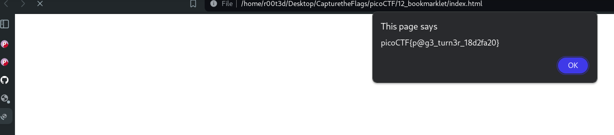

# start
start by launching the instance and then go to the link given <br>
There there is a js script given do do one thing copy it and try running it in a console of web  <br>
It didn't worked for me it gave error  <br>

So I made a [info.js](../12_bookmarklet/info.js) and made a [index.html](../12_bookmarklet/index.html) and ran the file and got the flag in alert box  <br>


# Boom got the flag 
```
picoCTF{p@g3_turn3r_18d2fa20}
```
