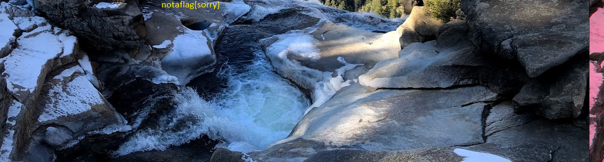

# start 

start by binwalking the file and try getting the idea about the file 

commands in linux 

```console

binwalk tunn3l_v1s10n

```


# this didn't worked

Try looking the detials of file in hexeditor 

found the first clue 
# It starts with "BM" i.e. bmp file 

since the file is corrupted try to compare this with the normal bmp file 

# There is an issue in header of the file
so change the header by comparing corrupted bmp file with the good bmp file 
now if you open the file it will show you image 


# After looking at the image it is clear the image is cropped so try finding the correect size by hit and trial
Image's width seems fine so try changing the image's height 

now do one thing run exittool on updated image to find it's height and width 

```console
exiftool tunn3l_v1s10n_updated.bmp
```

now convert the decimal dimension into hexadecimal to find the location in hexeditor so that we can tweek them to get the correct image

# I got the ans at height value of 825 