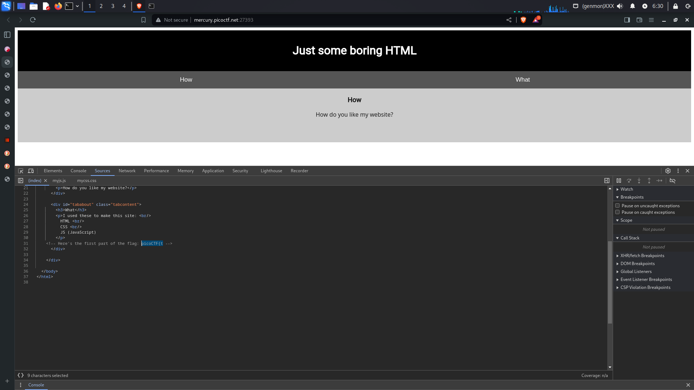
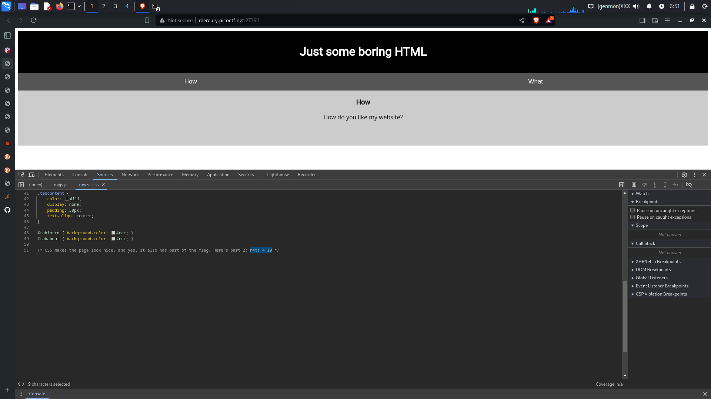
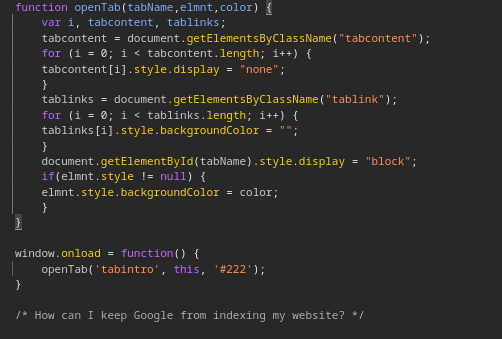
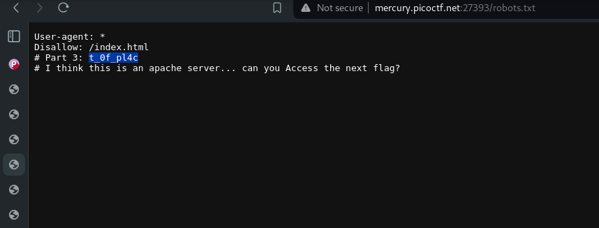
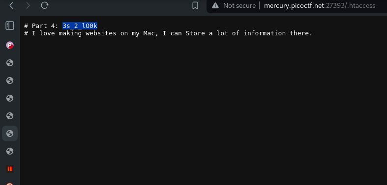

# start
Goto the link ->  [here](http://mercury.picoctf.net:27393/) <br>

Try inspecting the website<br>
First part of the flag is given in html file(it is commented )


Second part is in css file(it is commented)


After inspecting the js file there is a comment <br>


So it says that *How can I keep Google from indexing my website?* from this it can be deduced that there is something in robots.txt file 

**As we specify the files which should not be indexed in robots.txt**

so lets goto next url -> [here](http://mercury.picoctf.net:27393/robots.txt)

Here there is another part of the flag 


Now here there is written about apache server and there is capital in sentence *acces the flag* so it can be deduced that next part is in .htaccess files -> [here](http://mercury.picoctf.net:27393/.htaccess)

Here is the next part of the flage 


# Bomm !!!
completed the challenge 
```
picoCTF{th4ts_4_l0t_0f_pl4ct_0f_pl4c_d375c750}
```

